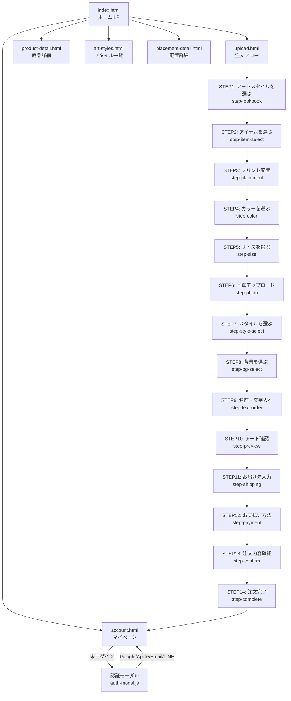

# Deer Brand — システム全体構成

> 更新日: 2026-04-04 | 対象: https://deer-brand.vercel.app

---

## 1. 全画面一覧

| # | 画面名 | URLパス | 対応ファイル | 主要機能 | 認証要否 |
|---|--------|---------|------------|---------|---------|
| 1 | ホーム（LP） | `/` | index.html | ヒーロー・製品紹介・アートスタイルギャラリー・CTA | 不要 |
| 2 | 注文フォーム | `/upload` | upload.html | 写真UP・スタイル生成・配置・決済（14ステップ） | 推奨（未認証でも進行可、決済前にログイン必須） |
| 3 | 商品詳細 | `/product-detail` | product-detail.html | ギャラリー・仕様・価格・サイズ表 | 不要 |
| 4 | アートスタイル一覧 | `/art-styles` | art-styles.html | 23スタイル一覧・フィルター | 不要 |
| 5 | 配置詳細 | `/placement-detail` | placement-detail.html | 配置説明・サイズ比較 | 不要 |
| 6 | マイページ | `/account` | account.html | 注文履歴・住所管理・カード管理・クーポン確認 | 必須 |
| 7 | 管理画面 | `/admin` | admin.html | 注文一覧・ステータス変更・クーポン管理 | 必須（管理者） |
| 8 | 特定商取引法 | `/tokushoho` | tokushoho.html | 特商法表記 | 不要 |

---

## 2. 画面遷移フロー

---

## 3. Firestoreコレクション構造

| コレクション | フィールド | 型 | 説明 |
|------------|----------|-----|------|
| **users** | uid | string | FirebaseユーザーUID |
| | email | string | メールアドレス |
| | displayName | string | 表示名 |
| | stripeCustomerId | string | StripeカスタマーID |
| | savedAddresses | array | 保存済み住所（最大5件） |
| | savedAddresses[].fullName | string | 氏名（フルネーム） |
| | savedAddresses[].email | string | メールアドレス |
| | savedAddresses[].phone | string | 電話番号 |
| | savedAddresses[].zip | string | 郵便番号 |
| | savedAddresses[].prefecture | string | 都道府県 |
| | savedAddresses[].address1 | string | 住所1 |
| | savedAddresses[].address2 | string | 住所2（任意） |
| | orders | array | 注文IDの配列 |
| | availableCoupons | array | 使用可能クーポン一覧 |
| | appliedCoupons | array | 使用済みクーポン一覧 |
| | createdAt | timestamp | 登録日時 |
| **orders** | orderId | string | DEER-YYYYMMDD-XXXX形式 |
| | userId | string | ユーザーUID |
| | product | string | 商品キー（例: tshirt） |
| | productName | string | 商品表示名 |
| | style | string | アートスタイル名 |
| | placement | string | プリント配置名 |
| | color | string | カラー |
| | size | string | サイズ |
| | petCount | number | ペット数 |
| | petNames | array | ペット名の配列 |
| | total | number | 合計金額（円） |
| | shippingAddress | object | 配送先住所オブジェクト |
| | paymentIntentId | string | StripeのPaymentIntent ID（無料注文は"FREE-ORDER"） |
| | couponCode | string | 使用クーポンコード |
| | igDiscount | number | IGフォロー割引額 |
| | igDiscountApplied | boolean | IGフォロー割引適用フラグ |
| | status | string | pending / preparing / shipped / delivered |
| | createdAt | timestamp | 注文日時 |
| | updatedAt | timestamp | 更新日時 |
| **coupons** | code | string | クーポンコード |
| | discount | number | 割引額または割引率 |
| | type | string | fixed（固定額）/ percent（パーセント） |
| | maxUses | number | 最大使用回数 |
| | usedCount | number | 使用済み回数 |
| | isActive | boolean | 有効フラグ |
| | description | string | クーポン説明文 |
| | expiresAt | timestamp | 有効期限（任意） |
| **couponUsage** | userId | string | 使用ユーザーUID |
| | code | string | 使用クーポンコード |
| | usedAt | timestamp | 使用日時 |
| **adminMeta** | — | — | 管理者メタデータ（詳細はadmin-api.js参照） |
| **rateLimits** | — | — | APIレート制限用カウンター |

---

## 4. API一覧

| # | エンドポイント | メソッド | 認証方式 | 主要パラメータ | 主要処理 |
|---|--------------|---------|---------|--------------|---------|
| 1 | /api/create-order | POST | Firebaseトークン（Authorization ヘッダー） | userId, product, style, placement, color, size, petCount, petNames, total, shippingAddress, paymentIntentId, couponCode, igDiscount | Stripe PaymentIntent検証 → Firestoreにorder保存 → savedAddresses保存 → Resend確認メール送信 |
| 2 | /api/generate-art | POST | なし（レート制限あり） | imageBase64, style, bgStyle | Gemini Vison APIでAIアート生成 |
| 3 | /api/remove-bg | POST | なし | imageBase64 | 背景除去処理 |
| 4 | /api/stripe-payment-intent | POST | なし | amount, currency, orderId | Stripe PaymentIntent作成 → clientSecret返却 |
| 5 | /api/stripe-setup-intent | POST | なし | userId | Stripe SetupIntent作成（カード保存用） |
| 6 | /api/stripe-webhook | POST | Stripe署名（stripe-signature ヘッダー） | Stripeイベントペイロード | payment_intent.succeeded → order status更新 |
| 7 | /api/admin-api | GET/POST | Firebaseトークン（管理者UID照合） | action, orderId, status, etc. | 注文一覧取得・ステータス更新・クーポン管理 |
| 8 | /api/validate-coupon | POST | なし | code, userId, total | クーポン存在確認・有効性チェック・使用回数チェック |
| 9 | /api/verify-ig-follow | POST | なし | imageBase64またはusername | Instagram Vision AIフォロー確認 |
| 10 | /api/printful-webhook | POST | Printful署名 | Printfulイベントペイロード | 発送完了通知 → order status更新 |
| 11 | /api/get-user | GET | Firebaseトークン | Authorization: Bearer {token} | Firestoreユーザーデータ取得 |
| 12 | /api/line-callback | GET | LINEコード（OAuth） | code, state | LINEトークン取得 → Firebaseカスタムトークン発行 |

---

## 5. 認証プロバイダー

| プロバイダー | 実装状態 | 備考 |
|-----------|---------|------|
| Google | 実装済み | js/auth-config.js |
| Apple | 実装済み | js/auth-config.js |
| メール/パスワード | 実装済み | js/auth-config.js |
| LINE | 実装済み | api/line-callback.js → Firebaseカスタムトークン |

---

## 6. 外部サービス依存関係

| サービス | 用途 | 環境変数 |
|---------|-----|---------|
| Firebase Authentication | ユーザー認証 | FIREBASE_PROJECT_ID, FIREBASE_CLIENT_EMAIL, FIREBASE_PRIVATE_KEY |
| Firestore | データベース | 同上 |
| Stripe | 決済処理・カード保存 | STRIPE_SECRET_KEY, STRIPE_WEBHOOK_SECRET, STRIPE_PUBLISHABLE_KEY |
| Google Gemini | AIアート生成 | GEMINI_API_KEY |
| Resend | メール送信 | RESEND_API_KEY |
| LINE Login | LINE認証 | LINE_CHANNEL_ID, LINE_CHANNEL_SECRET |
| Printful | 商品印刷・発送 | PRINTFUL_API_KEY, PRINTFUL_WEBHOOK_SECRET |
| Vercel | ホスティング・Serverless Functions | — |
